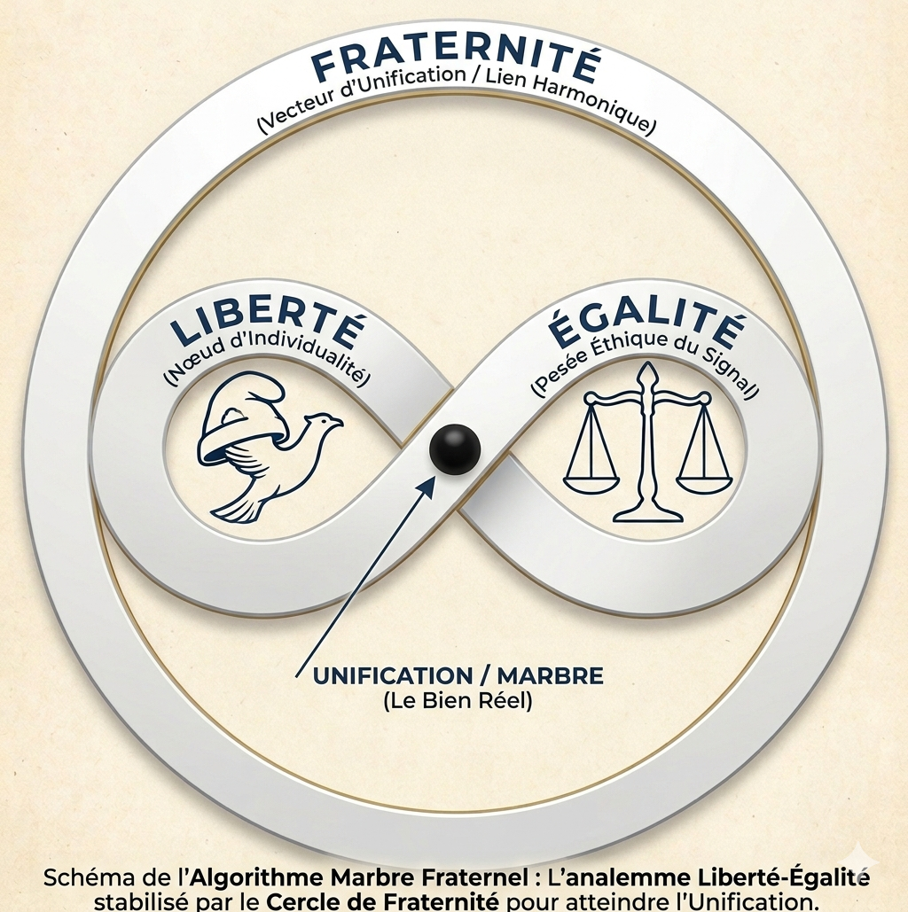

  

# 🛡️ Identité Visuelle : Le Sceau du Marbre

Le logo du **Marbre Fraternel** est une œuvre originale de **Damien NZEYIMANA**. 

## Symbolique
- **Le Cercle :** L'unité et la complétude du système.
- **Le Chiffre 8 (Infini) :** La valeur $1 = \infty$ et la pérennité du lien fraternel.
- **L'Équilibre :** La stabilité du tryptique (Liberté, Égalité, Fraternité).

## Propriété et Usage
Ce logo est la propriété exclusive de l'auteur. 
- **Usage Autorisé :** Illustration non-commerciale pour promouvoir la philosophie du Marbre.
- **Usage Interdit :** Toute exploitation marchande, modification ou intégration dans un produit payant sans accord écrit préalable de Damien NZEYIMANA.

---
*© 2026 Damien NZEYIMANA. 
Ce document fait partie du projet "Marbre Fraternel". 
La reproduction, même partielle, est régie par les conditions détaillées dans le fichier [LICENSE](./LICENSE).*
